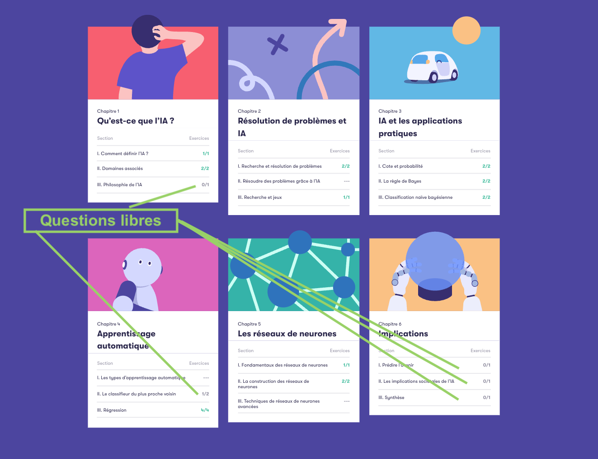

# Spécifications Techniques : Questionnaire de Certification IA

**Version : 1.0 (Draft)**
**Date : 16/10/2025**

## 1. Objectif de la fonctionnalité

L'objectif est de créer un questionnaire de certification sur l'IA pour les candidats. Ce questionnaire est multi-étapes, dynamique, et fournit un feedback immédiat à l'utilisateur pour favoriser l'apprentissage. La progression est sauvegardée à chaque étape.

## 2. Parcours Utilisateur

1.  Après paiement Stripe, l'utilisateur accède au questionnaire depuis une section dédiée de son profil. (refléchir si le paiement intervient avant ou après).
2.  L'étape 1 du questionnaire s'affiche avec ses questions.
3.  L'utilisateur répond aux questions de l'étape. Les types de réponses peuvent être : choix unique (radio), choix multiples (checkbox), texte libre (input) ou nombre (input number).
4.  L'utilisateur clique sur le bouton "Valider l'étape".
5.  Les champs de réponse sont désactivés.
6.  Pour chaque question, la correction s'affiche :
    *   La réponse de l'utilisateur est mise en évidence (vert si correct, rouge si incorrect).
    *   En cas d'erreur, la bonne réponse est affichée sous la question.
    *   Une explication peut également être affichée.
7.  Le bouton "Valider l'étape" se transforme en "Étape suivante".
8.  L'utilisateur clique sur "Étape suivante" pour charger la prochaine série de questions. Le processus se répète jusqu'à la dernière étape.
9.  À la fin de la dernière étape, le bouton est "Terminer le questionnaire". Un clic sur ce bouton enregistre la complétion finale du test.

## 3. Architecture Technique

### 3.1. Modèles de Données (Typescript)

Le système s'appuiera sur les modèles de données suivants, définis dans `types/aiCertificationQuiz.ts`.

```typescript
// types/aiCertificationQuiz.ts

export type QuestionType = 'radio' | 'checkbox' | 'text' | 'number';

export interface QuestionOption {
  optionId: string;
  textKey: string; // Clé de traduction pour le texte de l'option
}

export interface Question {
  questionId: string;
  textKey: string; // Clé de traduction pour la question
  questionType: QuestionType;
  options?: QuestionOption[]; // Présent pour 'radio' et 'checkbox'
}

export interface QuizStep {
  stepId: string;
  stepTitleKey: string; // Clé de traduction pour le titre de l'étape
  illustrationUrl?: string;
  questions: Question[];
}
```

### 3.2. Contrat d'API (Endpoints)

La communication avec le back-end suivra le contrat ci-dessous.

#### 3.2.1. Récupérer une étape du questionnaire

*   **Endpoint :** `GET /api/quiz/step/{stepNumber}`
*   **Description :** Récupère la structure complète d'une étape donnée.
*   **Réponse (200 OK) :**
    ```json
    {
      "stepId": "step1",
      "stepTitleKey": "quiz.ai.step1.title",
      "illustrationUrl": "/images/ai_step1.png",
      "questions": [
        {
          "questionId": "q1",
          "textKey": "quiz.ai.step1.q1.text",
          "questionType": "radio",
          "options": [
            { "optionId": "q1opt1", "textKey": "quiz.ai.step1.q1.option1" },
            { "optionId": "q1opt2", "textKey": "quiz.ai.step1.q1.option2" }
          ]
        }
      ]
    }
    ```

#### 3.2.2. Soumettre les réponses d'une étape

*   **Endpoint :** `POST /api/quiz/step/{stepId}/submit`
*   **Description :** Envoie les réponses de l'utilisateur pour une étape, sauvegarde la progression et renvoie la correction.
*   **Payload (Requête) :**
    ```json
    {
      "answers": [
        { "questionId": "q1", "answer": "q1opt1" }
      ]
    }
    ```
*   **Réponse (200 OK) :**
    ```json
    {
      "feedback": [
        {
          "questionId": "q1",
          "isCorrect": false,
          "userAnswer": "q1opt1",
          "correctAnswer": "q1opt2",
      "explanationKey": "quiz.ai.step1.q1.explanation"
        }
      ]
    }
    ```

### 3.3. Architecture Front-end

#### 3.3.1. Gestion de l'État (Redux)

Un nouveau slice Redux (`aiCertificationQuiz.slice.ts`) sera créé pour gérer l'état local du questionnaire.

*   **État initial :**
    ```typescript
    {
      currentStep: 1,
      stepStatus: 'answering', // 'answering' | 'loading' | 'submitted'
      userAnswers: {}, // { "q1": "q1opt1" }
      stepResults: {} // Stocke le payload de feedback de l'API
    }
    ```

#### 3.3.2. Composants React

De nouveaux composants seront créés dans `components/candidate/aiCertificationQuiz/`.

*   **`QuizContainer.tsx` :** Composant principal qui gère la logique de récupération des données, l'état global du quiz et l'affichage de l'étape courante.
*   **`QuizStep.tsx` :** Affiche les informations d'une étape (titre, questions) et gère les deux modes (`Saisie` et `Correction`).
*   **`QuestionRenderer.tsx` :** Composant "intelligent" qui lit le `questionType` d'une question et affiche le champ de formulaire correspondant (radio, checkbox, input...).

### 3.4. Gestion des Traductions (i18n)

La stratégie de traduction s'appuie sur le système existant (`/locales`).

*   Le back-end fournit des **clés de traduction** (ex: `quiz.ai.step1.title`).
*   Le front-end utilise ces clés avec la fonction `t()` pour chercher la traduction correspondante dans les fichiers JSON (`fr.json`, `en.json`, etc.) embarqués dans l'application.
*   Toutes les traductions sont donc gérées et centralisées côté front-end.



